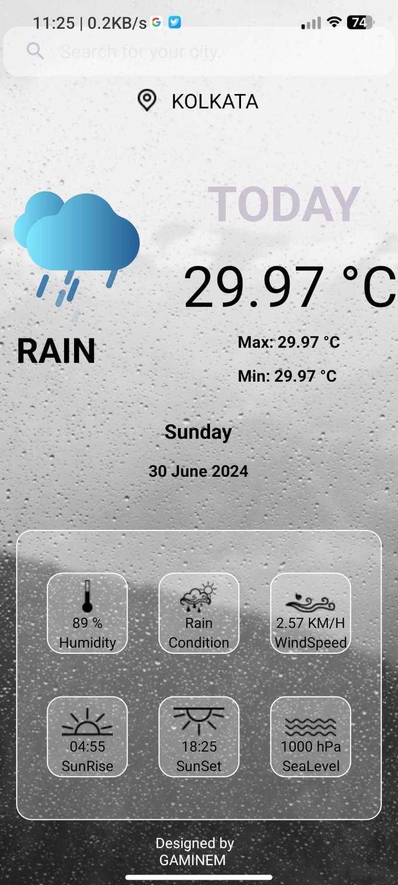
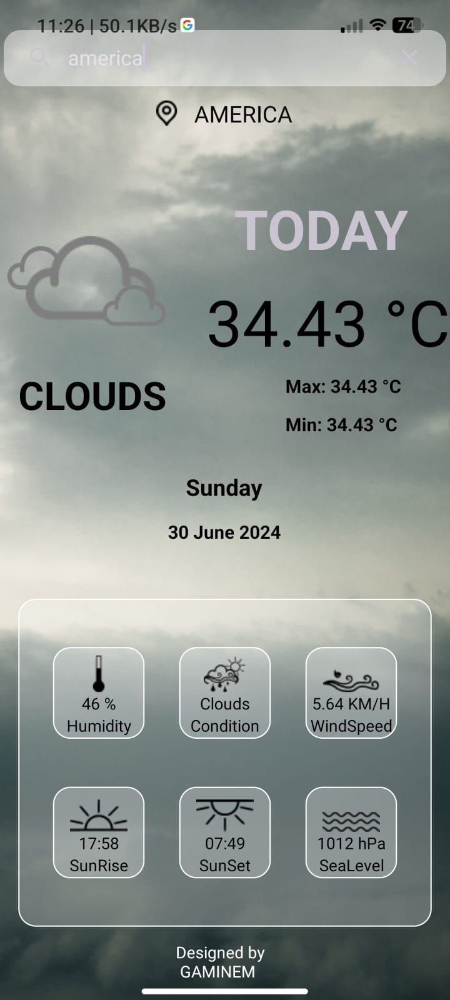

# WeatheringWithYou


WeatheringWithYou is a weather app developed using Kotlin and XML on Android Studio.

## Features

- **Current Weather**: Display current weather conditions for a selected location.
- **Weather Forecast**: Provide a forecast for the upcoming days.
- **Location-based**: Can fetch weather data based on user given location.

## Screenshots




## Installation

To run this project, follow these steps:

1. Clone the repository:
   ```bash
   git clone https://github.com/GAMINEM/WeatheringWithYou.git

2. Open the project in Android Studio.
3. Build and run the app on an emulator or physical device.

## Usage
- Upon launching the app, it will prompt for location access (if not already granted).
- View current weather information and forecast by navigating through the app.
- Customize settings as per preferences (units, update frequency).

## Technologies Used
- Kotlin
- XML
- Android Studio
